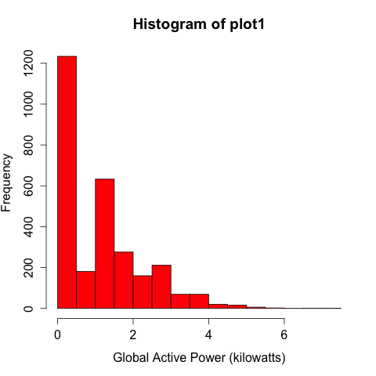
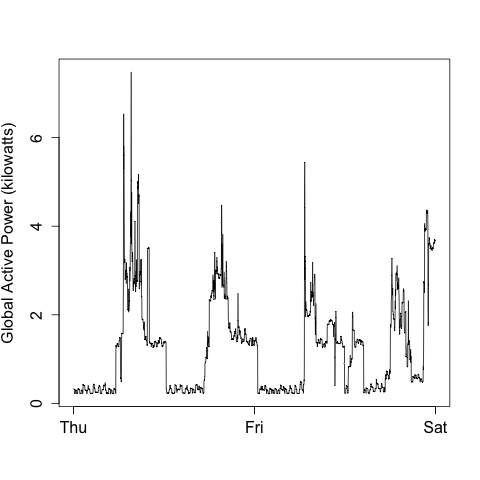
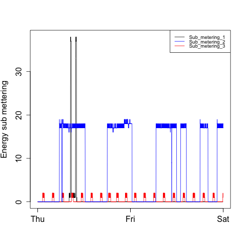
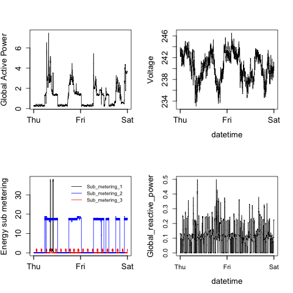

In order to execute the scripts to generate the png plots, you must download the dataset  <a href="https://d396qusza40orc.cloudfront.net/exdata%2Fdata%2Fhousehold_power_consumption.zip">Electric power consumption</a> 
, unzip  and save the data file "household_power_consumption.txt" in the same directory. 

Scripts can be executed with code similar to this:


```
source("plot1.R")
```

## This are the generated plots

### Plot1 



### Plot2



### Plot3



### Plot4

